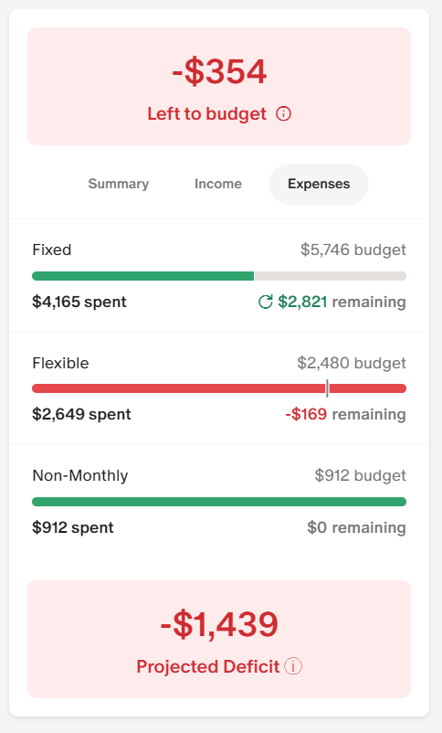
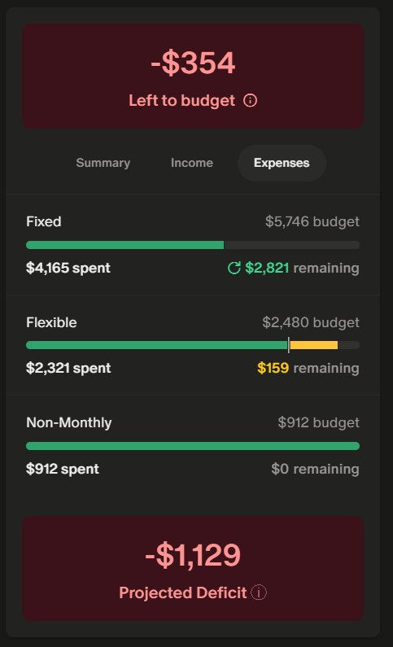

# Monarch Money Projected Cash Flow

A Tampermonkey userscript that adds a **Projected Surplus / Deficit** indicator to the [Monarch Money](https://www.monarchmoney.com/) budget page.

Monarch's built-in "Left to budget" number tells you how much of your income you haven't assigned to categories yet. It doesn't tell you whether you're actually on track to have money left over at the end of the month. This script answers that question.

## What it does

The script injects a new indicator in the budget sidebar that shows your projected surplus or deficit for the month. It looks and feels like a native part of Monarch's UI.

| Light mode | Dark mode |
|:---:|:---:|
|  |  |

See more examples in the [screenshots](screenshots/) folder (light/dark, surplus/deficit, projected/actual).

**The formula:**

```
Projected Surplus = max(income_budget, income_actual) - Σ max(actual, budget) per expense category
```

For income, whichever is greater wins — if you earned more than budgeted, the script uses what you actually received.

For each expense category:
- Spent less than budgeted? Uses the budget (you'll probably spend the rest).
- Spent more than budgeted? Uses the actual (the overspend is real).

For past months, the script switches to actual values only: `income_actual - Σ actual_spending`. No projections — just what really happened.

## Features

- Matches Monarch's native styling (colors, fonts, border radius)
- Supports both light and dark mode
- Updates reactively when you edit budgets, change months, or expand categories
- Shows "Projected Surplus/Deficit" for current and future months
- Shows "Surplus/Deficit" (actuals only) for past months
- Works with collapsed sections via section-level fallback totals
- Handles SPA navigation (no reload needed)

## Installation

1. Install [Tampermonkey](https://www.tampermonkey.net/) for your browser
2. Click [this link to install the script](https://raw.githubusercontent.com/mcintirc/Monarch-Money-Projected-Cash-Flow/main/src/monarch-projected-surplus.user.js) (Tampermonkey will prompt you)
3. Navigate to your [Monarch budget page](https://app.monarch.com/plan)
4. The indicator appears at the bottom of the sidebar card

**Manual install:** Create a new script in Tampermonkey and paste the contents of [`src/monarch-projected-surplus.user.js`](src/monarch-projected-surplus.user.js).

## How it works

The script is a self-contained Tampermonkey userscript. It reads values directly from the rendered budget page DOM — no API calls, no authentication, no data storage.

1. Scrapes the "Total Income" budget and actual values from the section footer
2. Scrapes each expense category's budget (from the input field) and actual (from the link element)
3. Computes the projected surplus using the formula above
4. Injects the result into the sidebar card, styled to match Monarch's theme
5. A MutationObserver watches for DOM changes and recalculates automatically

## Limitations

- **DOM selectors may break** if Monarch updates their frontend. The script uses styled-component class prefixes (e.g., `PlanSectionFooter__Root`) which are reasonably stable but not guaranteed. If the script stops working after a Monarch update, the selectors will need updating.
- **No data persistence.** The script calculates fresh from the DOM every time.

## Development

The core calculation logic is extracted into `src/calculate.js` with unit tests:

```bash
npm install
npm test
```

## License

[MIT](LICENSE)
